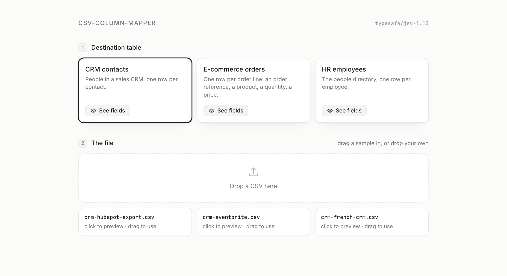
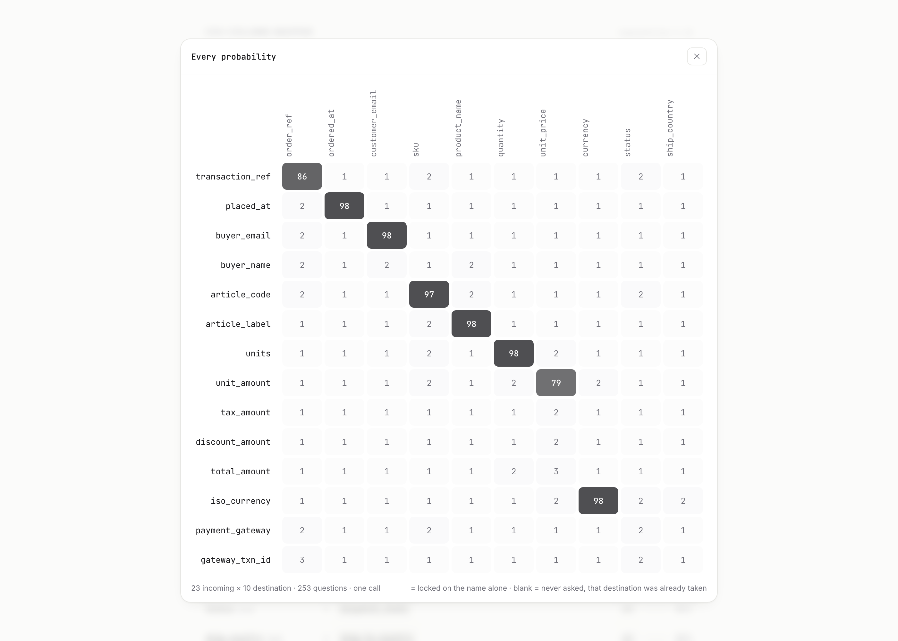

# csv-column-mapper

**Your users upload a CSV. Its columns are never your columns. This maps them,
and tells you how sure it is.**

Every product that accepts a file ends up building the same screen: two lists
side by side, a dropdown per field, and a user who has to explain that
`Lineitem sku` is your `sku`. This is the piece that fills that screen in
before they get there.

It is a small library, not a service and not a framework. Two files do the
work, there are no dependencies, and the whole thing is meant to be read in an
afternoon and pasted into your own import flow.

```js
import { mapColumns, readCSV } from './lib/index.mjs';

const result = await mapColumns({
  schema,                                  // your destination table
  columns: readCSV(uploadedText),          // [{ name, samples }]
  filename: 'orders-warehouse-export.csv',
});

result.mapping.sku;    // { source: 'article_code', p: 0.96, method: 'jev' }
result.mapping.status; // { source: 'status', p: 1, method: 'exact' }
result.ignored;        // [ 'pick_zone', 'pallet_id', ... ]
```

A real run, on a 23 column warehouse export against a 10 column orders table:
**10 of 10 mapped, 253 questions in one call, 915 ms, $0.0012.**


The screenshots on this page are the demo in this repository, running on the
sample files in this repository. Nothing is mocked.

## How it works

Two stages, and the order matters more than either one of them.

```text
  uploaded file
        │
        │  1. strict equality on normalised names
        │     case, accents, separators. Nothing else.
        │     free, instant, never wrong
        ▼
  what is left ────▶  2. one typed yes/no per remaining pair
        │                 (incoming column x destination column)
        │                 plus one guard per incoming column
        ▼
  greedy one-to-one resolution above a threshold
        │
        ▼
  { mapping, suggestions, ignored, matrix, orphan }
```

**Stage 1 does typography and nothing else.** `First Name` and `first_name`
are the same word with a different separator, so that pair is locked and never
costs anything. `Company Name` and `company` are not, and neither are `team`
and `department`: those are questions, and they go downstream. On a clean
HubSpot export stage 1 settles 7 columns out of 10 before a single network
call.

**Stage 2 asks one independent boolean per pair**, rather than one
multiple-choice question per column. That shape is the actual design decision
here. A multiple choice has to pick an option even when none of them fit, and
on a genuine tie it answers with a confident number and no signal that it was a
tie. A matrix of booleans lets a column map to nothing at all, which is exactly
the case where the file is missing one of your fields.

There is also **one guard question per incoming column**: "is there no home at
all for this column in the destination table?". That is the number that warns
you. A column that ends up unimported while its guard is low was not dropped
for having nowhere to go, it was dropped because no pair cleared the threshold.
Those are the ones a human should look at, and the demo flags them.


That is `crm-eventbrite.csv`: 4 of 10 mapped, six destinations left to a human
with their candidates ranked, and `Attendee` flagged rather than silently
dropped. It holds a full name, the table wants `first_name` and `last_name`,
and one column cannot map to two. The honest answer is the one on screen.

### What the model actually sees

The `state` carries your destination schema (column name, type and a
**description** of what it holds) and the incoming file (each column name plus
**three example values**, trimmed to 100 characters, ellipsis, 100 characters).

Both halves earn their place:

- The **descriptions** are what tell two neighbouring fields apart. `work_email`
  beats `personal_email` on a file that offers both because the description
  says "explicitly not a personal one".
- The **example values** do more work than the names. Shopify's `Name` column
  goes to `order_ref` at 93 percent and to `product_name` at 2 percent, because
  its values are `#1042` and not `Marit Halvorsen`.

## Try it locally

The demo is a test bench, not a product. It exists so you can watch the mapping
happen on nine real exports before wiring the library into your own import
flow.

```bash
git clone https://github.com/DuvInc/csv-column-mapper
cd csv-column-mapper
npm install              # installs nothing, and that is the point
cp .env.example .env     # then put your OpenRouter key in it
npm run demo
```

Then open **http://localhost:5211**. Pick a destination table, drag one of the
sample files into the drop zone, and read the mapping.



**View matrix** opens every probability that was asked for, and **See fields**
shows the destination descriptions the model reads.



The matrix is the thing to look at when a mapping surprises you. A clean run is
a diagonal of dark cells on an almost empty grid; two dark cells in one column
mean two incoming columns are competing for one destination, and a row with
nothing in it is a column your table has no home for.

`?table=ecom_orders&file=orders-warehouse-export.csv` deep links to one case,
and `&view=matrix` opens the matrix on arrival. Handy for showing somebody a
specific failure rather than describing it.

Without a key, the demo still starts and stage 1 still runs. Everything that
needs judgement comes back unmapped, which is a fair picture of what a purely
deterministic importer gives your users.

### The nine sample files

Three per destination table, and each one exists to break something.

| Table | File | What it tests |
| :--- | :--- | :--- |
| CRM contacts | `crm-hubspot-export.csv` | The easy case: most of it is deterministic |
| | `crm-eventbrite.csv` | Missing columns, extra columns, and `Attendee` is a full name where the destination wants first **and** last |
| | `crm-french-crm.csv` | All French, and two emails: `mail_pro` at 87 percent against `mail_perso` at 54 |
| E-commerce | `orders-shopify.csv` | The `Name` trap: at Shopify that is the order number, not a person |
| | `orders-minimal.csv` | Five terse columns for ten destinations |
| | `orders-warehouse-export.csv` | 23 columns, 13 to drop, and `unit_amount` against `total_amount` |
| HR | `hr-bamboo.csv` | Clean export names |
| | `hr-payroll.csv` | Abbreviations everywhere: `dept`, `start`, `type` |
| | `hr-identity-provider.csv` | `personal_email` against `company_email`, and `lead_email` for the manager |

## Putting it in your product

Three things to change, in order of how much they matter.

### 1. Your schema

A schema is a plain object. `demo/schemas.mjs` has three to copy the shape
from.

```js
const schema = {
  name: 'Orders',
  about: 'One row per order line.',
  columns: [
    { key: 'order_ref', type: 'text', desc: 'The order number or reference, not a person and not a product code' },
    { key: 'unit_price', type: 'money', desc: 'Price of one unit, before tax and discount, not the order total' },
  ],
};
```

**The `desc` is the highest-leverage thing you will write.** Say what the
column holds, and when a near miss exists, say what it does not hold. Most
mapping mistakes are fixed there rather than in code. If your schema lives in a
database, generate this from your column metadata and keep the descriptions
next to the columns they describe.

### 2. Your input

`readCSV(text)` is a convenience. The mapper only reads
`[{ name, samples: [...] }]`, so if your product already parses CSV, XLSX,
Google Sheets or an upstream API payload, keep your parser and build that array
yourself. Three sample values per column is the right number: it is enough to
recognise a shape, and everything beyond it is paid for on every request.

### 3. Your transport

`lib/jev.mjs` is the only file that talks to a service. Everything else is
pure. To go through your own gateway, a proxy that holds the key server side,
or a stub in tests, pass a `decide` function in:

```js
await mapColumns({ schema, columns, decide: myTransport });
```

```js
// The contract, in full.
async function myTransport({ state, questions, model, signal }) {
  return {
    answers: { [questionId]: { noul: 0.93 } },   // one per question id
    model: 'your-model',
    usage: { in: 0, out: 0, cost: 0 },
    ms: 0,
  };
}
```

That seam is why `npm test` needs no key and no network.

### And then: show the numbers

`mapColumns` proposes. It does not import anything, and it should not: the
whole point of a probability is that somebody can see it.

What the demo does with the result, and what your import screen probably should
too:

- **`mapping`** with `method` and `p`. An exact lock has no probability to
  show, and pretending otherwise ("100 percent") tells the user nothing.
- **`suggestions`** for every unmapped destination, so the manual dropdown is
  ranked with its scores rather than alphabetical.
- **`ignored`** as a visible list, not a silence. A column that is quietly not
  imported is the complaint you get three weeks later.
- **`orphan`** to flag the ignored columns that the model thinks do belong
  somewhere.

## What it costs, measured

Nine files, against jev 1.13 through OpenRouter.

| File | Mapped | Exact | Questions | Calls | Time | Cost |
| :--- | ---: | ---: | ---: | ---: | ---: | ---: |
| `crm-hubspot-export.csv` | 10/10 | 7 | 12 | 1 | ~640 ms | $0.000077 |
| `hr-bamboo.csv` | 8/10 | 5 | 18 | 1 | ~360 ms | $0.000109 |
| `orders-minimal.csv` | 5/10 | 0 | 55 | 1 | ~430 ms | $0.000287 |
| `hr-payroll.csv` | 10/10 | 2 | 72 | 1 | ~420 ms | $0.000362 |
| `crm-eventbrite.csv` | 4/10 | 0 | 77 | 1 | ~700 ms | $0.000395 |
| `orders-shopify.csv` | 10/10 | 1 | 90 | 1 | ~490 ms | $0.000462 |
| `crm-french-crm.csv` | 9/10 | 0 | 110 | 1 | ~520 ms | $0.000549 |
| `hr-identity-provider.csv` | 9/10 | 0 | 132 | 1 | ~605 ms | $0.000658 |
| `orders-warehouse-export.csv` | 10/10 | 0 | 253 | 1 | ~915 ms | $0.001222 |

A low "mapped" count is not a failure. `crm-eventbrite.csv` maps 4 of 10
because the file genuinely does not carry the other six, and saying so is the
correct answer.

**Time does not follow question count**: 12 questions cost 640 ms, 253 cost
915 ms. The model groups questions internally, and that property is what makes
the matrix approach practical at all. One boolean per pair would be absurd
against a chat model, both in latency and in price.

### The context window

The model documents two budgets, and they are not the same number:

- **64k tokens per request**: the `state` **plus every question** in it;
- **32k tokens**: the `state` plus the **single longest question**.

The 32k a gateway displays is the second budget, not the total. Measured: an
input of 62,552 tokens goes through, and just above it the request comes back
`max_tokens_exceeded`, which matches the announced 64k. There is no limit on
the number of questions: 4,000 short ones fit in one call.

Each question here weighs about 115 tokens, so a 23 column file against a 10
column table (253 questions, 29,313 tokens) is a single call. `planLots` splits
by estimated token budget only past roughly forty columns. The second budget
cannot be split, so if the `state` alone approaches 32k the library throws with
an explanation instead of letting an opaque 400 come back from the wire.

## The threshold

`MATCH_THRESHOLD`, 0.75 by default, and the only knob worth turning.

Below it a destination is left empty with its candidates offered. Raising it
sends more work to the human; lowering it fills fields that nobody will
re-read. It is deliberately cautious, because **a wrong column is worse than an
empty one**: an empty field is visibly missing, and a field filled with the
wrong data looks done.

## Tests

```bash
npm test     # 27 assertions, no network, no key, no cost
```

They cover the parts with judgement in them: what stage 1 will and will not
lock, the one-to-one resolution, the threshold, the token budget, and the
end-to-end path with a stubbed transport.

## What this is not

- **Not a data cleaner.** It maps columns. Parsing dates, normalising
  currencies and splitting `Attendee` into two name fields is transformation,
  and it belongs downstream.
- **Not an importer.** Nothing here writes a row.
- **Not a schema inference tool.** You bring the destination table.
- **Not deterministic across runs.** Stage 1 is. Stage 2 is a model, and the
  numbers move slightly. Anything that has to be reproducible must be pinned by
  the human confirming the mapping, not by the score.

## Credits

Built on [jev](https://typesafe.ai) by TypeSafe AI, a model that returns typed
decisions rather than text, reached here through
[OpenRouter](https://openrouter.ai). The approach would work against any
service that answers a bag of independent booleans; the shape of `decide` is
all this library assumes.

MIT licensed. See [CONTRIBUTING.md](./CONTRIBUTING.md) to send a patch, and
[AGENTS.md](./AGENTS.md) if an AI agent is doing the work.
